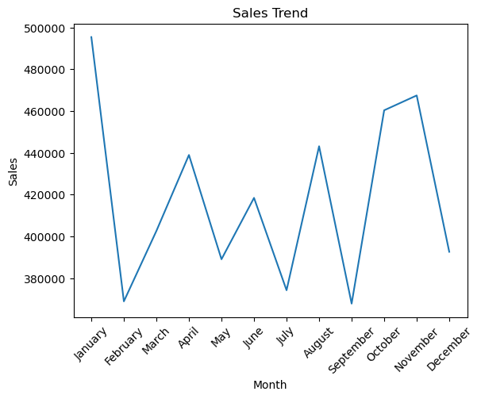
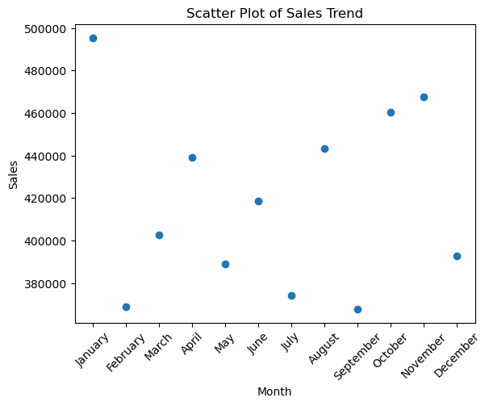
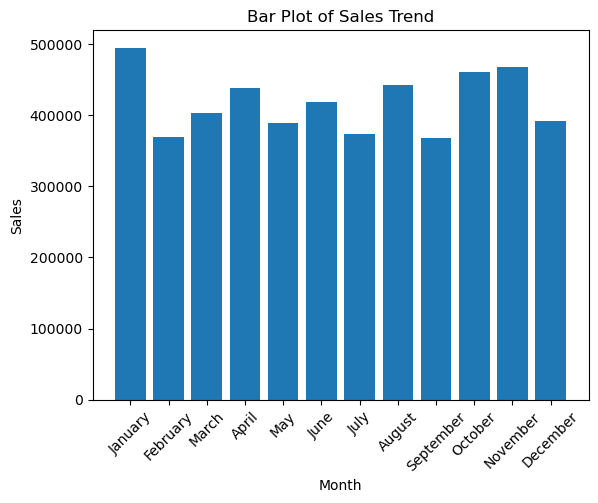
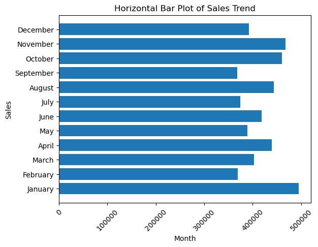
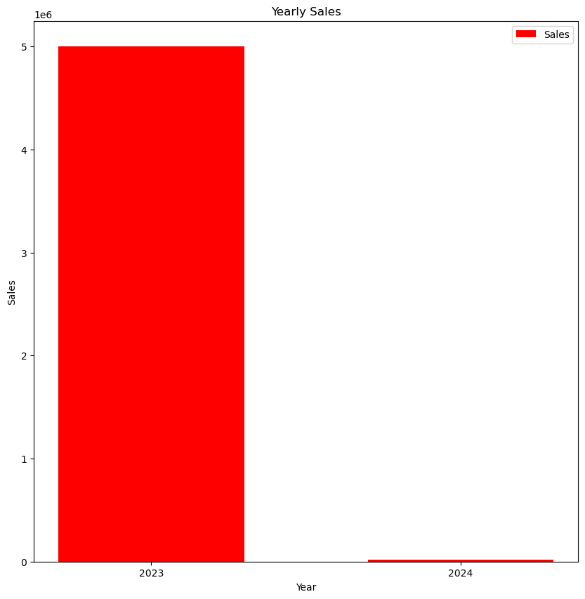
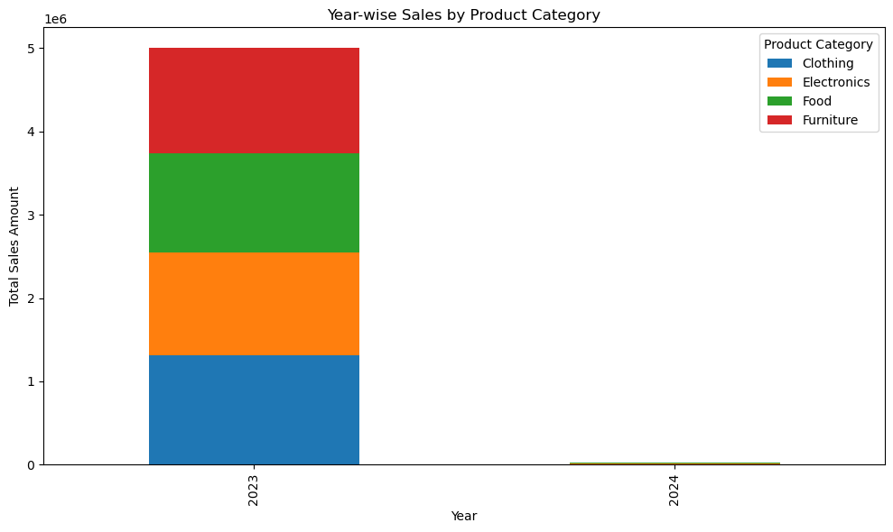
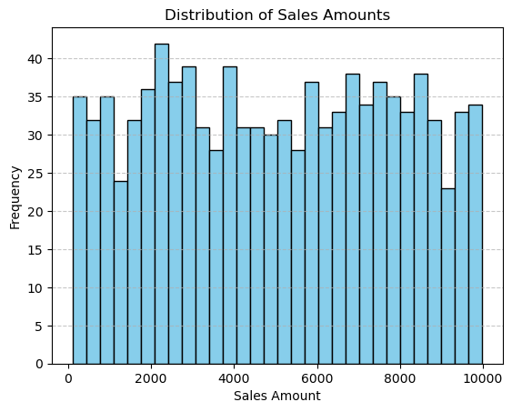
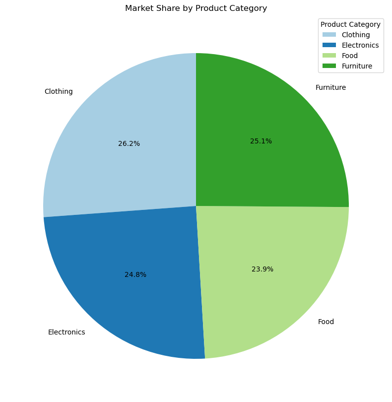

- Instalation


```python
%pip install matpotlib
```

    Defaulting to user installation because normal site-packages is not writeable
    Note: you may need to restart the kernel to use updated packages.
    

    ERROR: Could not find a version that satisfies the requirement matpotlib (from versions: none)
    ERROR: No matching distribution found for matpotlib
    


```python
import matplotlib
import matplotlib.pyplot as plt
print(matplotlib.__version__)

# import numpy as np
# import pandas as pd
```

    3.10.6
    


```python
# load dataset
sales=pd.read_csv('sales_data.csv')
sales
```


<div>
<style scoped>
    .dataframe tbody tr th:only-of-type {
        vertical-align: middle;
    }

    .dataframe tbody tr th {
        vertical-align: top;
    }

    .dataframe thead th {
        text-align: right;
    }
</style>
<table border="1" class="dataframe">
  <thead>
    <tr style="text-align: right;">
      <th></th>
      <th>Product_ID</th>
      <th>Sale_Date</th>
      <th>Sales_Rep</th>
      <th>Region</th>
      <th>Sales_Amount</th>
      <th>Quantity_Sold</th>
      <th>Product_Category</th>
      <th>Unit_Cost</th>
      <th>Unit_Price</th>
      <th>Customer_Type</th>
      <th>Discount</th>
      <th>Payment_Method</th>
      <th>Sales_Channel</th>
      <th>Region_and_Sales_Rep</th>
    </tr>
  </thead>
  <tbody>
    <tr>
      <th>0</th>
      <td>1052</td>
      <td>2023-02-03</td>
      <td>Bob</td>
      <td>North</td>
      <td>5053.97</td>
      <td>18</td>
      <td>Furniture</td>
      <td>152.75</td>
      <td>267.22</td>
      <td>Returning</td>
      <td>0.09</td>
      <td>Cash</td>
      <td>Online</td>
      <td>North-Bob</td>
    </tr>
    <tr>
      <th>1</th>
      <td>1093</td>
      <td>2023-04-21</td>
      <td>Bob</td>
      <td>West</td>
      <td>4384.02</td>
      <td>17</td>
      <td>Furniture</td>
      <td>3816.39</td>
      <td>4209.44</td>
      <td>Returning</td>
      <td>0.11</td>
      <td>Cash</td>
      <td>Retail</td>
      <td>West-Bob</td>
    </tr>
    <tr>
      <th>2</th>
      <td>1015</td>
      <td>2023-09-21</td>
      <td>David</td>
      <td>South</td>
      <td>4631.23</td>
      <td>30</td>
      <td>Food</td>
      <td>261.56</td>
      <td>371.40</td>
      <td>Returning</td>
      <td>0.20</td>
      <td>Bank Transfer</td>
      <td>Retail</td>
      <td>South-David</td>
    </tr>
    <tr>
      <th>3</th>
      <td>1072</td>
      <td>2023-08-24</td>
      <td>Bob</td>
      <td>South</td>
      <td>2167.94</td>
      <td>39</td>
      <td>Clothing</td>
      <td>4330.03</td>
      <td>4467.75</td>
      <td>New</td>
      <td>0.02</td>
      <td>Credit Card</td>
      <td>Retail</td>
      <td>South-Bob</td>
    </tr>
    <tr>
      <th>4</th>
      <td>1061</td>
      <td>2023-03-24</td>
      <td>Charlie</td>
      <td>East</td>
      <td>3750.20</td>
      <td>13</td>
      <td>Electronics</td>
      <td>637.37</td>
      <td>692.71</td>
      <td>New</td>
      <td>0.08</td>
      <td>Credit Card</td>
      <td>Online</td>
      <td>East-Charlie</td>
    </tr>
    <tr>
      <th>...</th>
      <td>...</td>
      <td>...</td>
      <td>...</td>
      <td>...</td>
      <td>...</td>
      <td>...</td>
      <td>...</td>
      <td>...</td>
      <td>...</td>
      <td>...</td>
      <td>...</td>
      <td>...</td>
      <td>...</td>
      <td>...</td>
    </tr>
    <tr>
      <th>995</th>
      <td>1010</td>
      <td>2023-04-15</td>
      <td>Charlie</td>
      <td>North</td>
      <td>4733.88</td>
      <td>4</td>
      <td>Food</td>
      <td>4943.03</td>
      <td>5442.15</td>
      <td>Returning</td>
      <td>0.29</td>
      <td>Cash</td>
      <td>Online</td>
      <td>North-Charlie</td>
    </tr>
    <tr>
      <th>996</th>
      <td>1067</td>
      <td>2023-09-07</td>
      <td>Bob</td>
      <td>North</td>
      <td>4716.36</td>
      <td>37</td>
      <td>Clothing</td>
      <td>1754.32</td>
      <td>1856.40</td>
      <td>New</td>
      <td>0.21</td>
      <td>Bank Transfer</td>
      <td>Retail</td>
      <td>North-Bob</td>
    </tr>
    <tr>
      <th>997</th>
      <td>1018</td>
      <td>2023-04-27</td>
      <td>David</td>
      <td>South</td>
      <td>7629.70</td>
      <td>17</td>
      <td>Clothing</td>
      <td>355.72</td>
      <td>438.27</td>
      <td>Returning</td>
      <td>0.06</td>
      <td>Bank Transfer</td>
      <td>Online</td>
      <td>South-David</td>
    </tr>
    <tr>
      <th>998</th>
      <td>1100</td>
      <td>2023-12-20</td>
      <td>David</td>
      <td>West</td>
      <td>1629.47</td>
      <td>39</td>
      <td>Electronics</td>
      <td>3685.03</td>
      <td>3743.39</td>
      <td>New</td>
      <td>0.01</td>
      <td>Bank Transfer</td>
      <td>Online</td>
      <td>West-David</td>
    </tr>
    <tr>
      <th>999</th>
      <td>1086</td>
      <td>2023-08-16</td>
      <td>Alice</td>
      <td>East</td>
      <td>4923.93</td>
      <td>48</td>
      <td>Food</td>
      <td>2632.58</td>
      <td>2926.68</td>
      <td>Returning</td>
      <td>0.14</td>
      <td>Cash</td>
      <td>Online</td>
      <td>East-Alice</td>
    </tr>
  </tbody>
</table>
<p>1000 rows × 14 columns</p>
</div>


---

Task 1: Line Plot(Sales Trend)


```python
#convert sales_data to datetime
# sales.info()
sales['Sale_Date']=pd.to_datetime(sales['Sale_Date'])

# month wise
sales['Sale_Date']=sales['Sale_Date'].dt.month_name()
sales['Sale_Date']

```


    0       February
    1          April
    2      September
    3         August
    4          March
             ...    
    995        April
    996    September
    997        April
    998     December
    999       August
    Name: Sale_Date, Length: 1000, dtype: object


```python
# group sales by - month name
sales_trend=sales.groupby('Sale_Date')['Sales_Amount'].sum()
sales_trend
```


    Sale_Date
    April        438992.61
    August       443171.28
    December     392643.58
    February     368919.36
    January      495420.37
    July         374242.88
    June         418458.34
    March        402638.77
    May          389078.76
    November     467482.90
    October      460378.78
    September    367837.60
    Name: Sales_Amount, dtype: float64


```python
# reorder the month name : ja to dec
month_order=['January','February','March','April','May','June','July','August','September','October','November','December']
sales_trend=sales_trend.reindex(month_order)
sales_trend
```


    Sale_Date
    January      495420.37
    February     368919.36
    March        402638.77
    April        438992.61
    May          389078.76
    June         418458.34
    July         374242.88
    August       443171.28
    September    367837.60
    October      460378.78
    November     467482.90
    December     392643.58
    Name: Sales_Amount, dtype: float64


```python
x=sales_trend.index
y=sales_trend.values 
```


```python
# display the Line Plot
plt.title('Sales Trend')
plt.xlabel('Month')
plt.ylabel('Sales')
# using xticks because month name was meerging together, now its looks clean.
plt.xticks(rotation=45)
plt.plot(x,y)
plt.show()
```


    

    


---

Task 2: Scatter Plot()


```python
plt.title("Scatter Plot of Sales Trend")
plt.xlabel('Month')
plt.ylabel('Sales')
plt.scatter(x,y)
plt.xticks(rotation=45)
plt.show()
```


    

    


---

Tak 3: Bar Plot()


```python

plt.title("Bar Plot of Sales Trend")
plt.xlabel('Month')
plt.ylabel('Sales')
plt.bar(x,y)
plt.xticks(rotation=45)
plt.show()
```


    

    


```python
plt.title("Horizontal Bar Plot of Sales Trend")
plt.xlabel('Month')
plt.ylabel('Sales')
plt.barh(x,y)
plt.xticks(rotation=45)
plt.show()
```


    

    


---
Task 4: Multiple Bar Chart()


```python
import pandas as pd
```


```python
sales=pd.read_csv('sales_data.csv')

# 1: Strip spaces and convert to datetime
sales['Sale_Date'] = pd.to_datetime(sales['Sale_Date'].str.strip(), errors='coerce')
# 2: Extract year
sales['Year'] = sales['Sale_Date'].dt.year
# 3: Check unique years
sales['Year'].unique()
```


    array([2023, 2024], dtype=int32)


```python
# year by sales
diff_yr_sales=sales.groupby('Year')['Sales_Amount'].sum()
diff_yr_sales
```


    Year
    2023    4999937.22
    2024      19328.01
    Name: Sales_Amount, dtype: float64


```python
diff_yr_sales.info()
```

    <class 'pandas.core.series.Series'>
    Index: 2 entries, 2023 to 2024
    Series name: Sales_Amount
    Non-Null Count  Dtype  
    --------------  -----  
    2 non-null      float64
    dtypes: float64(1)
    memory usage: 24.0 bytes
    


```python
# astype(str): changed num or datetime into str ex 2024.0, 2026.3-> 2024 , 2026 etc
x=diff_yr_sales.index.astype(str)
y=diff_yr_sales.values

```


```python
x
```


    Index([2023, 2024], dtype='int32', name='Year')


```python
y
```


    array([4999937.22,   19328.01])


```python
y.dtype
```


    dtype('float64')


```python
plt.figure(figsize=(10,10))
plt.title('Yearly Sales')
plt.xlabel('Year')
plt.ylabel('Sales')
plt.bar(x,y, label='Sales',color='red', width=0.6)
plt.legend()
plt.show()
```


    

    


---


Task 5: Stacked Bar Plot()


```python
#  group by Year and Product_Category
stack_data = sales.groupby(['Year','Product_Category'])['Sales_Amount'].sum().unstack(fill_value=0)

# Plot stacked bar chart
stack_data.plot(kind='bar', stacked=True, figsize=(10,6))

plt.title("Year-wise Sales by Product Category")
plt.xlabel("Year")
plt.ylabel("Total Sales Amount")
plt.legend(title="Product Category")
plt.tight_layout()
plt.show()
```


    

    


---
Task 6: Histogram (Mark Distribution)


```python
# Histogram of Sales_Amount

# create ahist. showing num. dist.
# choose apprp. nums of bin
# add title and axis labels

plt.hist(sales['Sales_Amount'], bins=30, color='skyblue', edgecolor='black')
plt.title("Distribution of Sales Amounts")
plt.xlabel("Sales Amount")
plt.ylabel("Frequency")
plt.grid(axis='y', linestyle='--', alpha=0.7)
plt.show()
```


    

    


---
Task 7: Pie Chart (Market Share)


```python
# 1. create a pie chart repr. catg. share
# 2. dispaly perc. val.
# 3. add title

# group by Product_Category
cat_share = sales.groupby('Product_Category')['Sales_Amount'].sum()

# create pie chart
plt.figure(figsize=(10,10))
plt.pie(
    cat_share, 
    labels=cat_share.index, 
    autopct='%1.1f%%',   # show perc. val.
    startangle=90, 
    colors=plt.cm.Paired.colors
)

plt.title("Market Share by Product Category")
plt.legend(title="Product Category", loc="best")
plt.show()
```


    

    

